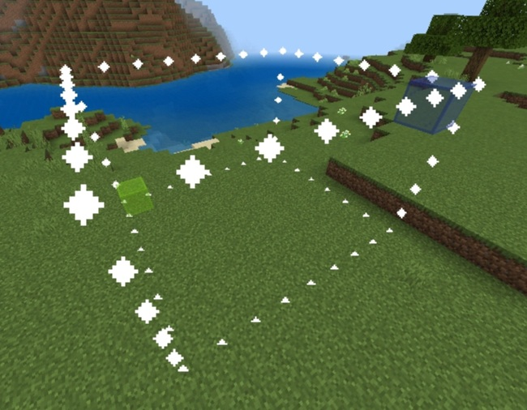
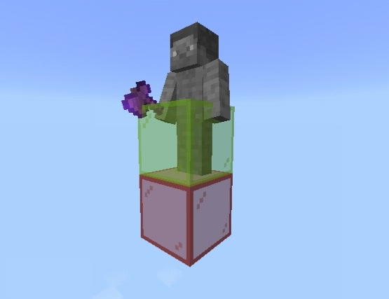

# Quick Start

## Before anything else...

By default, players are not allowed to use WorldEdit. Only those tagged as a builder can use its features. To make yourself a builder, enter `/tag @s add builder` in chat. You should then receive a message saying that you have been giving WorldEdit permissions.

!!! Tip

    You can also make other players builders by changing `@s` to the player's name. You'll need to surround it in quotes if it has a space in it. Eg: `/tag "Steve Wanderer" add builder`

## Going places

!!! Notice

    The commands provided by this addon use a semicolon (;) instead of a bracket (/).
    In the future, Mojang might add actual custom commands support to Minecraft.

Getting from point A to point B can sometimes be a hassle.
Luckily, this addon comes with what's known as a Navigation Wand.
To get one, you can either have a compass in your inventory, or enter the command `;navwand`.

Once you have this item, just interact with it to get teleported to the spot you are looking at.
Want to get on the otherside of a wall or ceiling? Use the wand while sneaking to go right through it!
Stuck in a block? Using the wand will get you unstuck!

!!! Tip

    If you don't want to use the navigation wand, these actions can also be done with the commands `;junpto`, `;thru` and `;unstuck` as well.

## Making selections

Like the original mod, you use what's known as a Selection Wand to easily mark regions of your world for various operations.
To get one, you enter the command `;wand`.

Selections in WorldEdit are cuboid shaped by default.
To make a selection, you need to mark the two corners of this cuboid.
You mark the first corner by using the wand on a block at that corner while sneaking.
You mark the second point by using it on a block _without_ sneaking. 
If done correctly, you should see a highlight of your selection.

If there's no block for you to mark a corner with, like high in the air, you can also use the commands `;pos1` or `;pos2` to mark the first and second corner respectively, as the position you are currently standing in. This is not the same as the position you are standing _on_.

## Doing stuff with your selection

Make a modest sized selection to work with.
We're going to try some of the commands WorldEdit has to offer.

1. Set the selection to stone using `;set minecraft:stone`. `minecraft:` is optional. Blocks provided by other addons need their namespace explicitly defined. Eg: `wiki:block`.
2. Set it to yellow wool with `;set wool:4`. Some blocks like wool come in different variations. The number after the block id determines the variation used.
3. Set the selection to half sandstone, half glass with `;set sandstone,glass`.
4. Replace the sandstone with dirt with `;replace sandstone dirt`.
5. Repeat your selection upwards with `;stack 4 up`.

If you want to you can undo everthing with `;undo 5`, since you did five successful operations.

## Playing with brushes
1. Get a shovel of any type (preferably wooden).
2. Bind a cobblestone brush to your shovel of radius 3 with `;br tier sphere cobblestone 3`. `tier` is the kind of shovel you're binding the brush to. 1 is wooden, 2 is stone, and so on.
3. Aim at the ground not near you and interact with the shovel (now brush) to place cobblestone spheres.
4. Make it so the brush only affects grass with `;mask tier grass`. Use the brush now to make a cobblestone path.
5. Disable the brush with `;br tier none`.

## No commands? No problem

If typing commands isn't your thing, whether it's because you don't use a keyboard, or their complicated, this addon gives you a simpler alternative.
If you get a wooden axe instead of using `;wand`, you'll be given a bunch of items as alternatives to commands. They're not as extensive as commands, but allow you to do the more common tasks more quickly, such as copying and pasting, and setting up brushes.

## What now?

You still have the rest of the docs you can look through. Go ahead and explore!